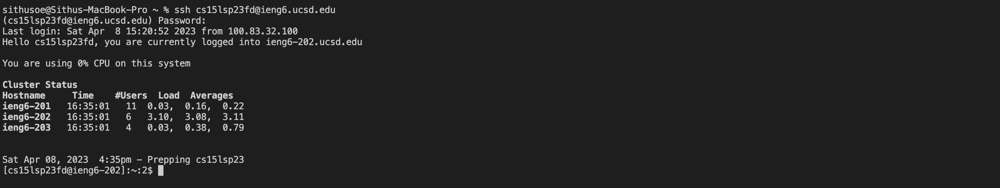
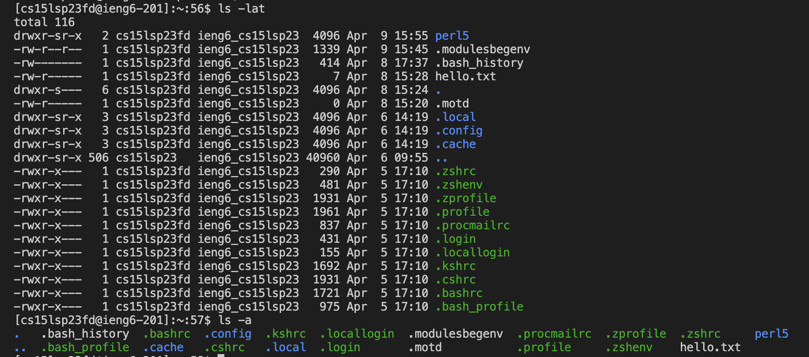
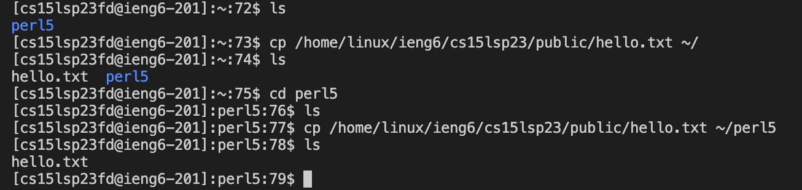

# Lab Report 1: Remote Access and File System

### Overview
In Week 1, we learned how to log into a course-specific account on ieng6. In the following blog, I will be laying out the series of steps I took to access a remote server from my own computer. I will also be going over some newly learned commands that I used to navigate my own computer and the remote computer. Please note that the following instructions are **specifically only for Mac users**.

### Step 1: Installing Visual Studio Code

Since I had already installed Visual Studio Code, often referred to as VSCode, I actually did not need to go through this step. If I did not have VSCode, I would have needed to download it. VS Code is a code editor developed by Microsoft, and it has consistently been one of the most popular integrated development environment (IDE) among developers. I have used a variety of IDEs, and I must say that VSCode is by far my favorite IDE. If you want to download VSCode, click [here](https://code.visualstudio.com/download). It is a very easy process! The picture below shows you the VSCode interface.


### Step 2: Remote Connection

I had so much difficulties connecting to a remote server. However, I don't think you will experience much difficulties. It is actually a very simple process that was unnecessarily hard for me because my course-specific account had some sort of bug. To connect to a remote server, all you need to do is follow the following steps: 
1. Lookup your course-specific username [here](https://sdacs.ucsd.edu/~icc/index.php)
2. If you do not know your password or need to reset your password, follow the instructions [here](https://drive.google.com/file/d/17IDZn8Qq7Q0RkYMxdiIR0o6HJ3B5YqSW/view)
3. Open a fresh new terminal in your VSCode
4. Type in the command `ssh cs15lsp23zz@ieng6.ucsd.edu` with zz replaced by the letters in your course-specific account. 
5. If you are trying to connect to a remore server for the first time, you may see a message similar to `The authenticity of host 'ieng6-202.ucsd.edu (128.54.70.227)' can't be established. RSA key fingerprint is SHA256:ksruYwhnYH+sySHnHAtLUHngrPEyZTDl/1x99wUQcec. Are you sure you want to continue connecting (yes/no/[fingerprint])?`. I typed in "yes".   
6. You will be prompted for your password. Type in your password.
7. Pray that you get successfully logged into the remote server after you type in your password. If successful, you should see a message similar to the code snippet below:

```
Last login: Sat Apr  8 15:20:52 2023 from 100.83.32.100
Hello cs15lsp23fd, you are currently logged into ieng6-202.ucsd.edu

You are using 0% CPU on this system

Cluster Status 
Hostname     Time    #Users  Load  Averages  
ieng6-201   16:35:01   11  0.03,  0.16,  0.22
ieng6-202   16:35:01   6   3.10,  3.08,  3.11
ieng6-203   16:35:01   4   0.03,  0.38,  0.79

 
Sat Apr 08, 2023  4:35pm - Prepping cs15lsp23
```
The following picture shows you the entire process of how I successfully connected to the remote server. Unfortunately, this picture does not contain the authentication part. However, the authentication part is just a matter of typing in "yes" to the terminal. Use the picture below as a guide!


Here, you might be wondering where I faced difficulties like I mentioned above. I purposely asked you to pray that you get successfully logged into the remote server after typing in your password. In my experience, after I typed in my password, I got the error message `Connection to ieng6.ucsd.edu closed by remote host. Connection to ieng6.ucsd.edu closed.` How did I fix this? I first tried changing my password to see if it would help. However, even after changing my password and using my new password, I was still receiving the same error message. I then tried to log into one of the lab computers to see if my course-specific account was functioning in the first place. I could log in. Unsure of what to do, I emailed Dr Politz for help. He emailed one of the school adminstrators to help me with the issue. The school adminstrator then resolved the issue by running a server synchronization process. Since then, I have been able to connect to the remote server.

### Step 3: Trying Some Commands
This is where you can explore some useful commands that can help you navigate your own computer or the remote computer. I explored the following commands: 
* `cd ~`
* `cd`
* `ls -lat`
* `ls -a`
* `ls <directory> where <directory> is /home/linux/ieng6/cs15lsp23/cs15lsp23abc, where the abc is one of the other group members’ username`
* `cp /home/linux/ieng6/cs15lsp23/public/hello.txt ~/`
* `cat /home/linux/ieng6/cs15lsp23/public/hello.txt`

The commands cd ~ and cd have the same functionality. They take you back to the user's home directory. 

The commands ls-lat and ls-a are also very similar in the sense that they list all the files in the current directory. However, the command ls-lat lists the file vertically, while the command ls-a the files horizontally. 

The command ls <directory> lists all the files in the given <directory>. When I tried to type the command `ls <directory> where <directory> is /home/linux/ieng6/cs15lsp23/cs15lsp23abc`, where the abc is one of the other group members’ username, I received the message "access denied." This is probably because there is some security in place to ensure that we cannot just look at the files in another's user without their permission. 
```
[cs15lsp23fd@ieng6-201]:~:58$ ls /home/linux/ieng6/cs15lsp23/cs15lsp23ej 
ls: cannot open directory /home/linux/ieng6/cs15lsp23/cs15lsp23ej: Permission denied
```
The command `cp /home/linux/ieng6/cs15lsp23/public/hello.txt ~/` seemed like it copied the hello.txt file to the home directory. To check, I wrote the command cp /home/linux/ieng6/cs15lsp23/public/hello.txt ~/perl5. Sure enough, the directory perl5 then had the file hello.txt, confirming my suspecion that the command cp copies the file from the first argument to the directory given in the second argument. 

The command `cat /home/linux/ieng6/cs15lsp23/public/hello.txt` simply displays the hello.txt content in the terminal. 
```
[cs15lsp23fd@ieng6-201]:perl5:79$ cat /home/linux/ieng6/cs15lsp23/public/hello.txt
Hello!
```
