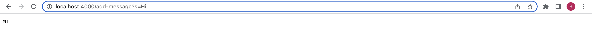
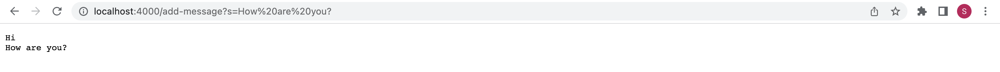

# Lab Report 2 - Servers and Bugs

## Part 1 - Creating a Web Server
The following code has been copied from the starter code provided in Week 2. This file essentially allows us to host a web server on our local computer! It is stored inside a file named Server.java.
```
import java.io.IOException;
import java.io.OutputStream;
import java.net.InetSocketAddress;
import java.net.URI;

import com.sun.net.httpserver.HttpExchange;
import com.sun.net.httpserver.HttpHandler;
import com.sun.net.httpserver.HttpServer;

interface URLHandler {
    String handleRequest(URI url);
}

class ServerHttpHandler implements HttpHandler {
    URLHandler handler;
    ServerHttpHandler(URLHandler handler) {
      this.handler = handler;
    }
    public void handle(final HttpExchange exchange) throws IOException {
        // form return body after being handled by program
        try {
            String ret = handler.handleRequest(exchange.getRequestURI());
            // form the return string and write it on the browser
            exchange.sendResponseHeaders(200, ret.getBytes().length);
            OutputStream os = exchange.getResponseBody();
            os.write(ret.getBytes());
            os.close();
        } catch(Exception e) {
            String response = e.toString();
            exchange.sendResponseHeaders(500, response.getBytes().length);
            OutputStream os = exchange.getResponseBody();
            os.write(response.getBytes());
            os.close();
        }
    }
}

public class Server {
    public static void start(int port, URLHandler handler) throws IOException {
        HttpServer server = HttpServer.create(new InetSocketAddress(port), 0);

        //create request entrypoint
        server.createContext("/", new ServerHttpHandler(handler));

        //start the server
        server.start();
        System.out.println("Server Started! Visit http://localhost:" + port + " to visit.");
    }
}
```
The following code has also been copied from the starter code provided in Week 2. However, it has been modified to implement a web server that supports adding new messages and rendering them on the screen. It is stored inside a file name StringServer.java.
```
import java.io.IOException;
import java.net.URI;
import java.util.ArrayList;

class Handler implements URLHandler {
    // The one bit of state on the server: a number that will be manipulated by
    // various requests.
    String toReturn = "";


    public String handleRequest(URI url) {
        if (url.getPath().equals("/")) {
            return "Add messages by using the path /add-message?s=<string>";
        } else if (url.getPath().contains("/add-message")) {
            String[] parameters = url.getQuery().split("=");
            toReturn += parameters[1] + "\n";
            return toReturn;
        } else {
            return "404 Not Found!";
        }
    }
}

public class StringServer {
    public static void main(String[] args) throws IOException {
        if (args.length == 0){
            System.out.println("Missing port number! Try any number between 1024 to 49151");
            return;
        }
        int port = Integer.parseInt(args[0]);
        Server.start(port, new Handler());
    }
}
```
We will now test our web server by adding some new messages! The following picture shows a user modifying the URL path to add new messages to the web page.

In the picture above, we can see that we succesfully added the message "Hi" to the web server. The handleRequest method was called to process the URL. The entire URL was passed into the handleRequest method as an argument. Based on the URL, the handleRequest method determines what to return. In the example above, we passed in the URL "http://localhost:4000/add-message?s=Hi". The handleRequest method first checks whether the URL merely has the default path with just "/". If the URL is not merely the default path, the method checks whether the URL contains "add-message". Since our URL contains "add-message", the code inside the if statement runs. Inside the if statement, we can see that the program is spliting the query around the "=" string and assigning it into a string list named parameters. The second part of the parameter, which is the string "Hi", is then added to the string toReturn, along with a newline character. Finally, the string toReturn is returned, allowing the web server to display the content inside toReturn, which has been modified to incorporate the newly added string with a new line character.


In the picture above, we can see that we succesfully added the message "How are you?" to the web server. It is pretty much identical to how "Hi" was added in the previous example. The handleRequest method was called to process the URL. The entire URL was passed into the handleRequest method as an argument. Based on the URL, the handleRequest method determines what to return. In the example above, we passed in the URL "http://localhost:4000/add-message?s=How are you?" Interesting, the URL was automatically changed to "http://localhost:4000/add-message?s=How%20are%20you?". By visual inspection, we can guess that the %20 is simply a space character as all the spaces in the URL that we passed in were replaced by %20. Like before, the handleRequest method first checks whether the URL merely has the default path with just "/". If the URL is not merely the default path, the method checks whether the URL contains "add-message". Since our URL contains "add-message", the code inside the if statement runs. Inside the if statement, we can see that the program is spliting the query around the "=" string and assigning it into a string list named parameters. The second part of the parameter, which is the string "How%20are%20you?", is then added to the string toReturn, along with a newline character. Finally, the string toReturn is returned, allowing the web server to display the content inside toReturn, which has been modified to incorporate the newly added string with a new line character.

## Part 2
We will investigate the bugs in ListTests.java. The following code snippet is an example of a failure-inducing input for the buggy program:
```
class firstLetterCapital implements StringChecker {
    public boolean checkString(String s){
        if (Character.isUpperCase(s.charAt(0))){
            return true;
        }
        return false;
    }
}

@Test
    public void testFilter(){
        List<String> stringArrayList = new ArrayList<>(Arrays.asList("Sithu Soe", "Basketball", "iPhone 14 Max Pro", "laptop"));
        List<String> actualOutput = ListExamples.filter(stringArrayList, new firstLetterCapital());
        List<String> expectedOutput = new ArrayList<>(Arrays.asList("Sithu Soe", "Basketball"));
        assertEquals(expectedOutput, actualOutput);
    }
```
The following code snippet is an example of an input that doesn't induce a failure:
```
class firstLetterCapital implements StringChecker {
    public boolean checkString(String s){
        if (Character.isUpperCase(s.charAt(0))){
            return true;
        }
        return false;
    }
}

@Test
    public void testFilterForPalindromeLinkedLists(){
        List<String> stringArrayList = new ArrayList<>(Arrays.asList("Sithu Soe", "Basketball", "iPhone 14 Max Pro", "laptop", "laptop", "iPhone 14 Max Pro", "Basketball", "Sithu Soe"));
        List<String> actualOutput = ListExamples.filter(stringArrayList, new firstLetterCapital());
        List<String> expectedOutput = new ArrayList<>(Arrays.asList("Sithu Soe", "Basketball", "Basketball", "Sithu Soe"));
        assertEquals(expectedOutput, actualOutput);
    }
```
The following picture shows the sympton of running the test in the first code snippet:


A failure-inducing input for the buggy program, as a JUnit test and any associated code (write it as a code block in Markdown)
An input that doesn’t induce a failure, as a JUnit test and any associated code (write it as a code block in Markdown)
The symptom, as the output of running the tests (provide it as a screenshot of running JUnit with at least the two inputs above)
The bug, as the before-and-after code change required to fix it (as two code blocks in Markdown)

## Part 3
I learned a lot in the previous two weeks of CSE15L. Some examples include: 
- Launching a local host from terminal: I had no idea that we could write a program to launch a local host from our terminal. Although I do not fully understand the starter code provided in Server.java and NumberServer.java, I have a good idea of how the programs works. I also learned how to use JUnit with command line argument. 
- Running JUnits tests with command line argument: In CSE12, we used Eclispe so that we do not need to use command line argument for JUnit tests. It feels good to know what Eclispe is doing under the hood for JUnit tests to function. 
- Writing a simple search engine: I did not know I had the tools to write a simple search engine. Implementing a simple search engine made me realize that some things are not as complicated as it seems. I did not have to use anything too sophisticated to write a web server that supports a path for adding a new string to the list and a path for querying the list of strings to return a list of all strings that have a given substring in Week 2.
