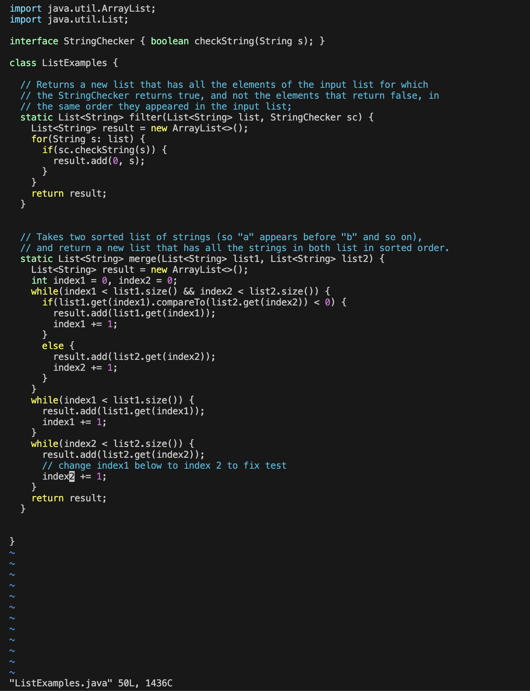

## Lab Report 4 - Doing it All From the Command Line

# Overview
Today, we will fix a bug in our code all from the command line and push it to our Github repository. 

## Step 1 - Logging into ieng6
To log into my ieng6 account, I just typed ``ssh cs15lsp23fd@ieng6.ucsd.edu`` into the terminal. The command ``ssh`` essentially allows you to connect to a remote computer. 

## Step 2 - Cloning a file from my Github account
To clone a file called "lab7" from my Github account, I just typed ``git clone git@github.com:SithuSoe04/lab7.git``. The command ``git clone`` allows you to clone a repository into your local or remote server.

## Step 3 - Running the tests
First, I navigated to the lab7 directory. Inside the directory, there is a file called "test.sh" that will run the appropriate tests for us. Consequently, I just needed to type ``bash test.sh`` to run the tests. The command  ``bash test.sh`` basically executes the lines written in the test.sh file.

## Step 4 - Editing code to fix the bug
As can be observed above, there seems to be some bugs in my code. I will fix the bug only using the command line. First, I typed ``vim ListExamples.java`` to go into the ListExamples.java file. Since I have prior knowledge that the error in the code is just that index1 is used instead of index2 in the final loop in merge, I searched for index1 by typing ``/index1`` in vim. Since I know that the final loop is near the end of the file, I pressed <shift + n> to get to the last usage of index1. I then pressed "e" to get to the last character of the word. After that, I pressed "x" to delete the last character. From there, I went into Insert mode by pressing "i". I then simply adding the character "2" to fix the bug! Finally, I went back into normal mode by pressing the esc key. I then saved and quit vim mode by entering the command ``:wq``. 
Keys Pressed:
1. vim ListExamples.java <enter>
2. /index1 <enter>
3. <shift + n>
4. e
5. x
6. i
7. 2
8. esc
9. :wq 

## Step 5 - Running the tests again

