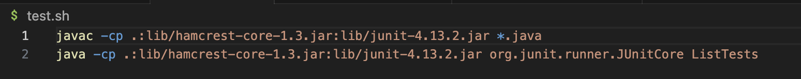
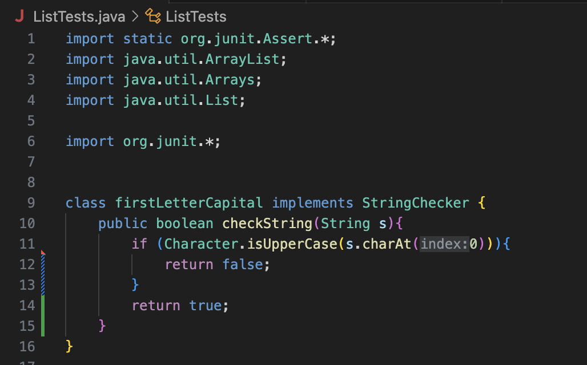
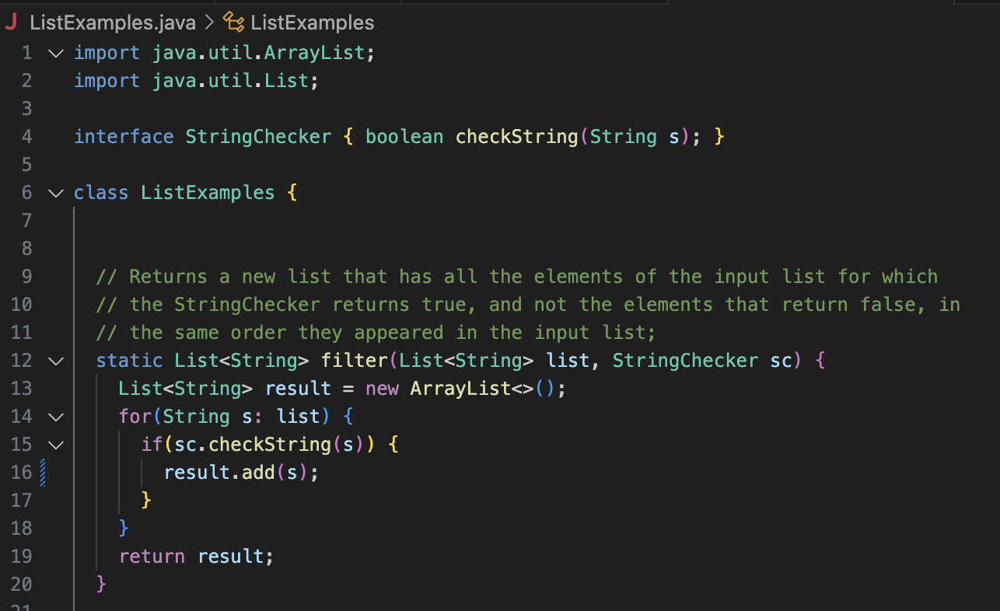
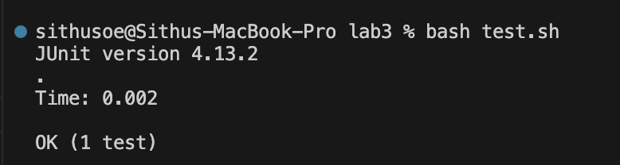
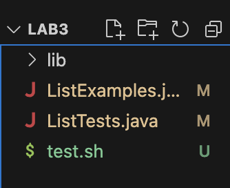
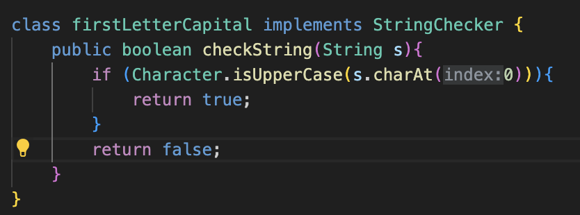

# Lab Report 5 - Debugging Scenario and Reflection

## What environment are you using (computer, operating system, web browser, terminal/editor, and so on)?
I am using a MacBook Pro 14-inch, 2021 with Apple M1 Pro chip. My macOS version is Venture 13.1. I am using VSCode to write the program and the terminal integrated into VSCode to run the program.

## Detail the symptom you're seeing. Be specific; include both what you're seeing and what you expected to see instead. Screenshots are great, copy-pasted terminal output is also great. Avoid saying “it doesn't work”.
I am running a testFilter test where the filter method is supposed to only give me back an arraylist with words that have their first letter capitalized. However, for some reason, the actual output is the exact opposite. The actual output only contains words that do not have their first letter capitalized. Since I am getting the exact opposite of my desired output, I am guessing that I am returning something of an opposite nature in my firstLetterCapital method.

## Detail the failure-inducing input and context. That might mean any or all of the command you're running, a test case, command-line arguments, working directory, even the last few commands you ran. Do your best to provide as much context as you can.
I am simply running a bash script. Inside the test.sh file, which was ran with bash script, I wrote two lines of code to run some JUnit tests. I have attached a screenshot of the test.sh file, along with the screenshots of ListExamples.java and ListTests.java, below to give you a better understanding of the content inside the file.

## TA Siracle's Response:
Hey Sithu, thank you for providing a very detailed explanation of the bug you are facing. It makes things a lot easier on my end. You are absolutely correct with your guess that you might be returning something of an opposite nature in your firstLetterCapital method. Based on how your filter method is written, which only adds the item to the arraylist when the checked condition is true, what should you return in your firstLetterCapital method when the first letter is an uppercase?

## Student Sithu's Response:
Hi TA Siracle, thank you so much for your response. It seems like I have carelessly been returning false when the first letter is capital in my firstLetterCapital method. All this time, I thought I have been checking that the first letter is not capital in my if condition, which is why I have been returning false if the condition is met. I have made the appropriate changes, and the test is now working as expected. Yay!

# Information about the setup
 
## The file & directory structure needed
Assuming you have the lib library with the appropriate JUnit files inside your current directory, you only need three other files in your current directory: ListExamples.java, ListTests.java, and test.sh. Refer to the screenshot below to get a better understanding of the file structure. 

## The contents of each file before fixing the bug
Please refer to the pictures below to get the contents of each file before fixing the bug. As you can see, the firstLetterCapital is returning false when the first letter is an uppercase. This is the exact opposite of the desired behavior. Based on the filter method, it is supposed to return true when the first letter is an uppercase. 

## The full command line (or lines) you ran to trigger the bug
I simply ran ``bash test.sh`` to trigger the bug. Inside the test.sh file, I ran some JUnit tests to test my program. Please refer to the screenshot below to get a better understanding of the test.file. 

## A description of what to edit to fix the bug
I simply needed to swap the return values in the firstLetterCapital method. Instead of returning false when the first letter is capital, I just had to return true. Otherwise, I needed to return false. Look at the screenshot below to see the fix!

# Reflection
The coolest thing I have learned in the second half of this quarter that I did not know before would be vim. I find it pretty crazy that I can edit files on a remote computer without even opening an editer like VSCode. There are endless things that can be done with vim. As much as I like vim, I do feel that they have weird syntax. I sometimes find myself blanking out in vim because every key pressed means something in vim. However, through more practice, I believe vim will become more natural to me. I hope to take advantage of vim to do more cooler things on a remote computer in the forseeable future! 

